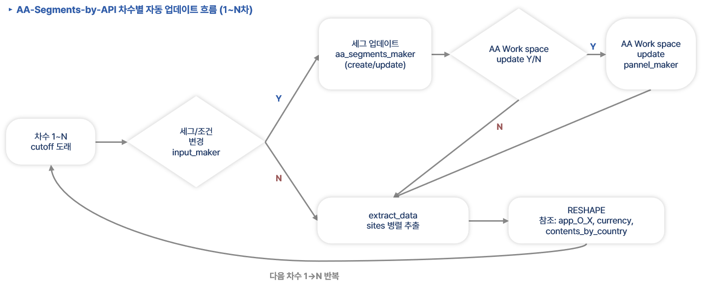

# contents Tier1 + Tier2 통합 추출·정제 (`_contents_tier1_2_uni`)  
<sub>2026-08-10  Jonghyun Park w/ Claude</sub>  

캠페인 메인 페이지의 **콘텐츠(CC_xx) 블록별 성과**(노출·클릭·주문·매출)를
Adobe Analytics 에서 뽑아 보고서용 CSV 한 장으로 만드는 폴더입니다.

**두 단계면 끝납니다.**

```bash
python extract_data_v4.3_contents.py        # 1) AA → 추출 CSV
python RESHAPE_contents_tier1_2_v2.0.py     # 2) 추출 CSV → union CSV 1개
```

---

## 0. 전체 흐름

흐름이 **두 층**입니다. 캠페인 시작 때 한 번 하는 **최초 구축(0-2)** 과,
차수(cutoff)마다 반복하는 **업데이트 루프(0-1)** 입니다.

### 0-1. 차수별 반복 흐름 (2차부터는 이 루프만)



차수 cutoff 가 오면 **"세그/조건이 바뀌었나"** 를 먼저 판단하고, 바뀐 것만 갱신한 뒤 추출로 갑니다.

| 분기 | 조건 | 하는 일 |
|---|---|---|
| 세그/조건 **변경 O** | 신규 콘텐츠·키워드 추가 등 | `input_maker` → `aa_segments_maker` (create/update) |
| ↳ Workspace 반영 필요 | 패널에 세그를 새로 꽂아야 함 | `panel_maker` 로 패널 갱신 |
| ↳ 반영 불필요 | 기존 세그 정의만 수정 | 바로 추출로 |
| 세그/조건 **변경 X** | 기간만 늘어난 차수 | **바로 추출** |

그 다음은 매 차수 동일합니다.

```
extract_data (sites 병렬 추출)  →  RESHAPE  →  다음 차수 반복
                                   참조: app_O_X · currency · contents_by_country
```

> **이 폴더가 담당하는 구간은 아래쪽 `extract_data → RESHAPE` 두 칸**입니다.
> 위쪽 세그 제작·패널 갱신은 `segment_maker/` · `panel_maker/` 소관입니다.

> ⚠ 차수가 바뀌면 **`currency.csv` 를 그 차수 환율로 갱신**해야 합니다.
> 안 그러면 지난 차수 환율로 매출이 환산됩니다 (에러가 안 나서 발견이 늦습니다).

### 0-2. 최초 구축 7단계

캠페인을 처음 세팅할 때의 순서입니다. 이 폴더가 담당하는 건 마지막 7단계뿐이고,
앞 단계가 끝나 있어야 돌릴 수 있습니다.

| # | 단계 | 방식 | 산출물 |
|---|---|---|---|
| 1 | 태깅 디버깅 | 거의 자동 (디버깅 툴) | 콘텐츠별 클릭 콜 목록 |
| 2 | **디버깅 검수 + 누락 콜 추가** | **수기** | 보정된 콜 목록 |
| 3 | input maker ref 제작 | 수기 → API 참조용 | `seg_make_ref*.csv` |
| 4 | 디폴트 세그 제작 | API | 기본 CC_xx 세그 |
| 5 | Visit / Delayed Order 세그 제작 | API (**eVar 필요**) | `(Visit)` / `(Delayed Purchase)` 세그 |
| 6 | **세그 검수** | **수기** | 확정 세그 |
| 7 | **데이터 추출·정제** | **← 이 폴더** | union CSV |

**7단계에 들어가기 전 준비물** (tier 에 따라 다릅니다):

| 대상 | 필요한 것 | 이 폴더에서 대응하는 것 |
|---|---|---|
| **Tier1** | site × 콘텐츠 영역별 **노출 여부(True/False)** | `contents_by_country.csv` |
| **Tier2** | 남길 **value 번호** (= Workspace 테이블 컬럼 순서) | `TIER2_VALUE_N` |

> 3~5단계 세그 제작 도구는 `segment_maker/` 에 있습니다
> (`seg_make_ref*.csv` → `input_csv_maker*.py` → `aa_create_segment_v*.py`).
> 6단계 검수를 건너뛰면 7단계 수치가 통째로 어긋나므로 반드시 거칠 것.

---

## 1. 이 폴더가 푸는 문제

예전에는 **같은 데이터를 두 번** 뽑았습니다.

| | 예전 | 지금 |
|---|---|---|
| 폴더 | `_contents`(Tier1) + `_contents_tier2_cc_03`(Tier2) 2개 | 이 폴더 1개 |
| AA 프로젝트 | 2개 | **1개** |
| 추출 실행 | 2회 | **1회** |
| 결과 CSV | 2개 (수기로 합침) | **1개** |

두 AA 프로젝트를 뜯어보니 **컬럼 구조가 완전히 같았습니다.** Tier2 프로젝트는
안 쓰는 자리를 `No Data` 세그로 메워 **자리수만 맞춘 사본**이었고, Tier1 쪽이 상위집합이었습니다.
그래서 Tier1 프로젝트로 전 site 를 한 번 뽑고, **정제 단계에서 site 별로 쓸 컬럼만 골라내는**
구조로 합쳤습니다.

---

## 2. 먼저 알아야 할 개념 — `valueN`

AA Workspace 의 contents 테이블은 이렇게 생겼습니다.

```
                 value1     value2        value4     value5 …  value16
                 (기준행)   CC_00         CC_02      CC_03  …  CC_10
  2026 (Jan~Dec)  3,883       322            0        278  …      12
```

- **세로 = 기간**(1행), **가로 = 콘텐츠 세그먼트**
- 가로 컬럼은 왼쪽부터 `value1 … value17` 로 번호가 붙습니다
- **어느 번호가 어느 콘텐츠인지는 5개 테이블 전부 동일합니다** ← 이게 핵심

| valueN | 내용 | | valueN | 내용 |
|---|---|---|---|---|
| `value1` | Campaign Main (기준행) | | `value10` | CC_04. Offer Card |
| `value2` | CC_00. Content Total | | `value11` | CC_05. AI Moment Film |
| `value4` | CC_02. Content A | | `value12` | CC_06. My Rewards Tracker |
| `value5` | CC_03. Scenario | | `value13` | CC_07. Synergetic Pairings |
| `value6~8` | CC_03 하위 01/02/03 | | `value14` | CC_08. Recommended for You |
| `value3`,`9`,`17` | 빈 자리 (`No Data`) | | `value15` | CC_09. FAQ |
| | | | `value16` | CC_10. SSD Banner |

번호가 고정이라 **"이 나라는 CC_03 만 쓴다" = "valueN 1,5,6,7,8 만 쓴다"** 로 표현할 수 있습니다.
정제코드의 `TIER2_VALUE_N` 이 바로 그것입니다.

---

## 3. site 3분류 — 어느 나라가 어느 컬럼을 쓰나

정제코드 상단에서 정합니다.

| 분류 | 대상 | 쓰는 valueN | 매트릭스 필터 |
|---|---|---|---|
| **Tier1** | `TIER1_SITES` 에 등록된 15개 | 전체 | ✅ 적용 |
| **Tier2** | 그 외 전부 | `TIER2_VALUE_N` = `1,5,6,7,8` | — (표에 없어 무영향) |
| **예외** | `SITE_VALUE_N_OVERRIDES` | 직접 지정 (예: `be` = `1,16`) | ✅ 적용 |

> `be` 가 `TIER1_SITES` 에 있는 건 의도입니다. Tier1 경로로 들어가되
> 실제 쓰는 컬럼은 예외 설정이 CC_10 하나로 좁힙니다.
> (예전 `sites_input.csv` 의 `only_cc_10_ssd_banner` 플래그를 코드로 옮긴 것)

### ⚠ tier 가 두 종류입니다 — 헷갈리기 쉬운 지점

| 상수 | 뜻 | 쓰이는 곳 |
|---|---|---|
| `TIER1_SITES` | **데이터 처리** — 어느 valueN 을 쓰고 매트릭스를 적용할까 | 행 필터링 |
| `TIER1_LABEL_SITES` | **사업 분류** — 보고서상 몇 티어 나라인가 | 출력 `tier` 컬럼 |

두 목록은 **거의 같지만 `be` 에서 갈립니다.** `be` 는 처리상 Tier1 경로를 타지만
사업 tier 는 `Tier 2` 입니다. 그래서 목록을 따로 둡니다.

---

## 4. "행을 지우는 것" vs "값만 0으로 만드는 것"

혼동하기 쉬운 부분입니다. **셋 다 다릅니다.**

| 무엇 | 결과 | 왜 |
|---|---|---|
| `valueN` 필터 | **행 자체가 안 나옴** | 그 나라가 아예 안 쓰는 콘텐츠 |
| 매트릭스 `False` | 행은 나오고 **`value_fx` 만 0** (`value_orig` 은 실측값) | 노출 안 한 콘텐츠지만 수치는 남겨둠 |
| App 미론치 (`app_O_X.csv` = X) | 위와 동일 | 앱이 없는 나라의 app/android/ios |

원본을 남기는 이유: 나중에 *"이 나라 이 콘텐츠 실제 수치가 뭐였나"* 를 되짚을 수 있어야 해서입니다.
`value_fx` 로 집계하고, 검증할 때 `value_orig` 을 봅니다.

---

## 5. 입력 파일 4종

> **repo 미포함(운영 데이터)** — 이 폴더에는 `*_example` 판만 들어 있다. `sites_input_example.csv` 등으로 형식을 확인하고 `_example` 을 뗀 이름으로 본인 데이터를 채워 같은 폴더에 저장해야 실행된다.

| 파일 | 역할 | 형식 |
|---|---|---|
| `sites_input.csv` | 뽑을 나라와 기간 | `site_code,start_date,end_date` |
| `currency.csv` | 매출 환산 환율 | `site_code,currency_code,2026-08-03,2025-08-03` |
| `app_O_X.csv` | 앱 론치 여부 | `site_code,App 론치 (O/X)` |
| `contents_by_country.csv` | 나라별 콘텐츠 노출 매핑 | 아래 전용 섹션 참조 |

### `sites_input.csv` — US 는 반드시 2행

미국은 캠페인 도중 report suite 가 교체돼 RSID 가 둘로 갈립니다. **한 행으로 뽑으면
교체일 이전 데이터가 통째로 빠집니다.**

```csv
site_code,start_date,end_date
us_old,2026-05-11,2026-05-18     ← 구 suite
us,2026-05-19,2026-06-07         ← 신 suite
```

정제 단계에서 `SITE_CODE_NORMALIZE` 가 둘을 `us` 한 줄로 합칩니다
(`rsid`/기간은 원본을 남겨 출처는 계속 구분됩니다).

### `currency.csv` — 환율은 **연도**로 찾습니다

헤더의 `YYYY-MM-DD` 에서 **연도만** 읽어 `(site, 연도) → 환율` 로 씁니다.
날짜 전체를 코드에 박으면 폴더를 복사할 때 매칭이 깨져 **환산이 조용히 빠집니다**
(현지통화 금액이 USD 인 척 나감). 그래서 연도 방식입니다.

> 이 폴더의 `currency.csv` 는 **site 마다 다른 차수의 환율을 병합**한 것입니다.
> 각 나라 데이터가 끝난 시점의 환율을 써야 해서입니다. 출처는 `currency_source.csv` 참고.

### `contents_by_country.csv` — 이 폴더의 사본이 원천

콘텐츠×국가 매트릭스입니다. **외부 Excel 을 절대경로로 물지 않습니다** — 폴더 안 CSV 사본만 읽으므로
다른 PC 나 repo 로 그대로 옮겨도 동작합니다.

표가 바뀌면 Excel 에서 새로 뽑아 **이 CSV 를 덮어쓰면** 됩니다.
스크립트가 대신 뽑게 하려면 `MATRIX_REFRESH_FROM_XLSX = True` + `MATRIX_XLSX` 경로를 지정하세요
(그 경우에도 실패하면 경고만 내고 기존 CSV 로 진행합니다).

---

## 6. 출력 — `output/_union_contents_tier1_2_<YYMMDD_HHMM>.csv`

보고서 raw 시트와 **같은 이름·같은 순서**라 그대로 붙여넣을 수 있습니다.

| 컬럼 | 의미 |
|---|---|
| `tier` | `Tier 1` / `Tier 2` — `TIER1_LABEL_SITES` 기준으로 자동 기입 |
| `subs` | **빈 값** — 캠페인마다 명칭 디테일이 달라 채우지 않음 |
| `country` | `site_registry` 가 site_code 로 찾은 국가명 |
| `site_code` | `us_old` 는 `us` 로 통합된 상태 |
| `report_no` | 보고서 어느 표에 들어갈 값인지 |
| `device_type` | PC / Mobile / App / Android / iOS |
| `metric` | Visits / Order / Revenue / Order+Delayed Order / Revenue+Delayed Revenue |
| `item` | 콘텐츠명 (`03. Scenario: Your Daily Sync` 등) |
| **`value_fx`** | **집계에 쓰는 값** — 환율 적용 + 0 처리 반영 |
| `value_orig` | 0 처리 전 실측값 — **환율 미적용 원본 통화** (검증용) |
| `origin_only_delayed_value` | 지연전환분만 따로 (환율 미적용) |
| `rsid`, `start_date`, `end_date` | 데이터 출처 |
| `value_n` | 위 2번의 컬럼 번호 |

---

## 7. 자주 겪는 문제

**Q. 추출은 됐는데 정제 결과 행 수가 예상보다 적다**
→ `[valueN filter]` 로그를 보세요. 그 site 가 Tier2 로 판정되면 5개 컬럼만 남습니다.
Tier1 이어야 하는 site 면 `TIER1_SITES` 에 추가하세요.

**Q. 매출이 현지통화 그대로 나온다**
→ 실행 끝의 `[WARN] 환율 미매칭` 을 확인하세요. `currency.csv` 에 그 site 행이나
데이터 연도 컬럼이 없으면 rate 1.0 이 적용됩니다.

**Q. 매트릭스 표를 고쳤는데 결과에 반영이 안 된다**
→ 이 폴더의 `contents_by_country.csv` 가 원천입니다. Excel 만 고치면 반영되지 않으니
CSV 를 새로 뽑아 덮어쓰세요 (또는 `MATRIX_REFRESH_FROM_XLSX = True` 로 켜세요).

**Q. US 데이터가 절반쯤 비어 보인다**
→ `sites_input.csv` 에 `us` 만 있고 `us_old` 가 없는 경우입니다 (위 5번 참고).

**Q. device 별로 값이 전부 같거나 0 이다**
→ `DEVICE_CASES`(add) 와 `DEVICE_SWAP_CASES`(replace) 를 **동시에 켠** 경우입니다.
추출기가 시작할 때 막지만, 직접 고쳤다면 한쪽을 비우세요.

**Q. 패널이 전부 skip 된다**
→ `US_PANEL_PREFIX` 가 `"[US]"` 로 대괄호를 포함하는지 확인하세요.
이 프로젝트 패널명이 `[US] …` 형태라 대괄호가 없으면 매칭이 안 됩니다.

---

## 8. 파일 목록

| 파일 | 설명 |
|---|---|
| `extract_data_v4.3_contents.py` | AA → 추출 CSV (`stack_*` / `table_*`) |
| `RESHAPE_contents_tier1_2_v2.0.py` | 추출 CSV → union CSV 1개 |
| `extract_data_contents.md` | 추출기 상세 문서 |
| `RESHAPE_contents_tier1_2_v2.0.md` | 정제코드 상세 문서 |
| `site_registry.py` | site_code → 국가/법인 조회 |
| `aa_segment_lookup.py` | 세그먼트 조회 (추출기가 import) |
| `sites_input.csv` / `currency.csv` / `app_O_X.csv` | 입력 — **repo 미포함(운영 데이터)**, `*_example` 판으로 형식 확인 후 직접 채울 것 |
| `currency_source.csv` | 환율 출처 기록 (site 별 차수) — repo 미포함(운영 데이터) |
| `contents_by_country.csv` | 콘텐츠×국가 매트릭스 (이 사본이 원천) — repo 미포함, `contents_by_country_example.csv` 참조 |
| `aa-seg-by-api-ref_img.png` | 차수별 반복 흐름도 (README 0-1) |
